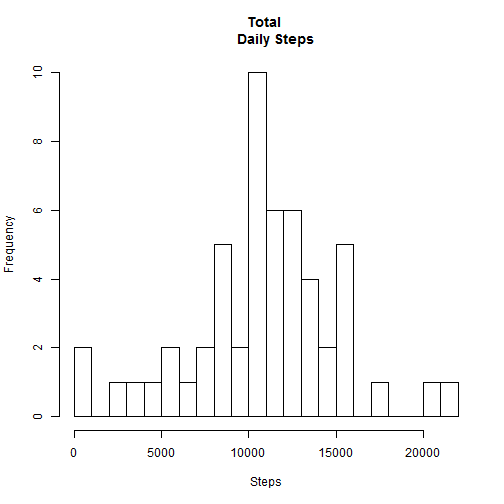
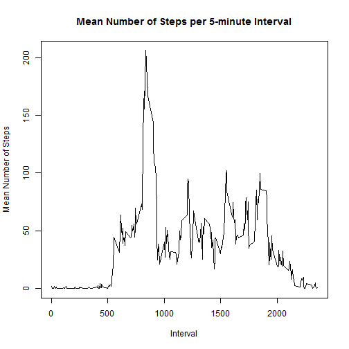
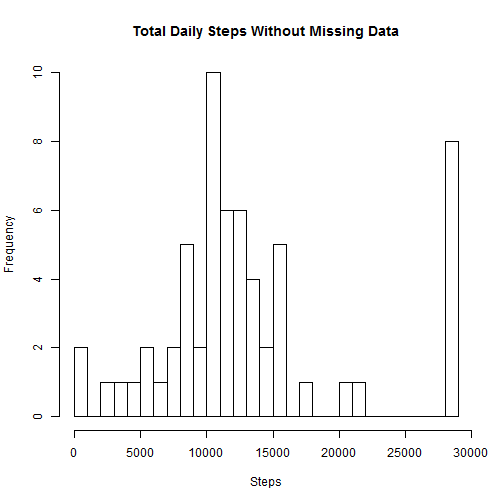
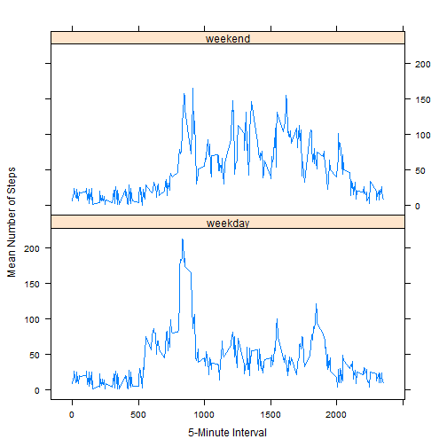

##Reproducible Research: Peer Assessment 1


###Set up R Environment


```r
setwd("~/Nicki/Reproducible_Research")
library(lattice)
echo=TRUE
```

###Load Data


```r
url <- "http://d396qusza40orc.cloudfront.net/repdata%2Fdata%2Factivity.zip"
download.file(url, "repdata-data-activity.zip", mode="wb")
unzip("repdata-data-activity.zip")
activity <- read.csv("activity.csv", colClasses = c("integer", "Date", "factor"))
```

###What is the mean total number of steps taken per day?
For this part of the assignment, you can ignore the missing values in the 
dataset

####a. Make a histogram of the total number of steps taken each day
Determine the total the number of steps taken per day.  If na.rm = TRUE is 
used here, the NAs are converted to 0's 


```r
daily.steps <- tapply(activity$steps, activity$date, FUN=sum)
dim(daily.steps)
```

```
## [1] 61
```

Make a histogram of the frequency of steps taken daily 


```r
hist(daily.steps, xlab = "Steps", breaks = 25, ylab = "Frequency", main = "Total 
     Daily Steps")
```

 

####b.  Calculate and report the mean and median total number of steps taken per day
Calculate the mean number of total daily steps


```r
mean(daily.steps, na.rm=TRUE)
```

```
## [1] 10766.19
```

```r
median(daily.steps, na.rm=TRUE)
```

```
## [1] 10765
```

The total steps taken per day shows a normal distribution as the mean and median are nearly identical (mean = 10766, median = 10765).

###2. What is the average daily activity pattern?

####a.  Make a time series plot (i.e. type = "l") of the 5 minute interval (x-axis) and the average number of steps taken, averaged across all days (y-axis)


```r
mean.intervals <- aggregate(activity$steps, list(interval = as.numeric(as.character(activity$interval))), FUN= "mean", na.rm=TRUE)
names(mean.intervals)[names(mean.intervals) == "x"] <- "Mean_Steps"
plot(mean.intervals$interval, mean.intervals$Mean_Steps, type="l", main = "Mean Number of Steps per 5-minute Interval", xlab="Interval", ylab="Mean Number of Steps")
```

 

####b.Which 5 minute interval, on average across all the days in the dataset, contains the maximum number of steps?


```r
mean.intervals[which.max(mean.intervals$Mean_Steps),]
```

```
##     interval Mean_Steps
## 104      835   206.1698
```

The 5-minute interval 835 contains the maximum average number of steps (206.2) recorded.

###3.  Inputing missing Values
Note that there are a number of days/intervals where there are missing values 
(coded as NA).  The presence of missing days may introduce bias into some calculations or summaries of the data.

####a.  Calculate and report the total number of missing values in the dataset (i.e. the total number of rows with NAs).


```r
sum(is.na(activity))
```

```
## [1] 2304
```

There are 2304 rows with NAs.

####b. Devise a strategy for filling in all of the missing values in the dataset. 
The strategy doesn not need to be sophisticated.  For example, you could used 
the mean/median for that day or the mean for that 5-minute interval, etc.

The strategy used here will be to replace NAs with a random number from 1 - 206 (the maximum number of steps per 5-minute interval).


```r
filldata <- activity
sum(is.na(filldata))
```

```
## [1] 2304
```

```r
mean.intervals$X <-  sample(206, size = nrow(mean.intervals), replace = TRUE)
for (i in 1:nrow(filldata)){
        if(is.na(filldata$steps[i])){
                filldata$steps[i] <- mean.intervals[which(filldata$interval[i] == mean.intervals$interval),]$X
        }
}
sum(is.na(filldata))
```

```
## [1] 0
```

####c.  Create a new dataset that is equal to the original dataset, but with the missing data filled in.


```r
filldata.total <- tapply(filldata$steps, filldata$date, FUN=sum)
dim(filldata.total)
```

```
## [1] 61
```

####d.  Make a histogram of the total number of steps taken each day and calculate and report the mean and median total number of stps taken per day.  
Do these values differ from the estimates from the first part of the assignment? What is the impact of inputing missing data on the estimates of the total daily number of steps?


```r
hist(filldata.total, xlab="Steps", breaks = 25, ylab = "Frequency", main = "Total Daily Steps Without Missing Data")
```

 

```r
mean(filldata.total)
```

```
## [1] 13256.52
```

```r
median(filldata.total)
```

```
## [1] 11458
```

The strategy used here to fill in NAs randomly with numbers from 1-206 produces a distribution that is skewed to the right.  As a result, the mean and median are no longer similar (mean = 13175.87, median = 11458).  A different strategy (i.e. filling in NAs with the mean number of steps per 5-minute interval) might produce a distribution similar to that of the original distribution.

###4.  Are there differences in activity patterns between weekdays and weekends?

####a.  Create a new factor variable in the dataset with two levels - "weekday" and "weekend" indicating whether a given date is a weekday or weekend day.


```r
filldata$days <- factor(format(filldata$date, "%A"))
levels(filldata$days)
```

```
## [1] "Friday"    "Monday"    "Saturday"  "Sunday"    "Thursday"  "Tuesday"  
## [7] "Wednesday"
```

```r
levels(filldata$days) <- list(weekday = c("Monday", "Tuesday", "Wednesday", "Thursday", "Friday"),
                                  weekend = c("Saturday", "Sunday"))
head(filldata)
```

```
##   steps       date interval    days
## 1    48 2012-10-01        0 weekday
## 2   115 2012-10-01        5 weekday
## 3   128 2012-10-01       10 weekday
## 4   195 2012-10-01       15 weekday
## 5   139 2012-10-01       20 weekday
## 6    69 2012-10-01       25 weekday
```

####b.  Make a panel plot containing a time series plot(i.e. type = "l") of the 5-minute interval (x-axis) and the average number of steps taken, averaged across all weekdays or weekend days (y-axis).  
See the README file the GitHub repository to see an example fo what this plot should look like using simulated data.


```r
meansteps <- aggregate(filldata$steps,
                      list(interval = as.numeric(as.character(filldata$interval)),
                           days = filldata$days),
                      FUN = "mean")
names(meansteps)[3] <- "Meansteps"
xyplot(meansteps$Meansteps ~ meansteps$interval | meansteps$days,
       layout = c(1,2), type = "l", xlab = "5-Minute Interval", ylab = "Mean Number of Steps")
```

 

There does appear to be differences in activity between weekdays and the weekend.  During the weekday, there are more steps taken between interval 500 to about 800 as compared to the same intervals on the weekend.  However, the most striking difference is the consistent increase in the mean number of steps taken from interval 900 - 1800 on the weekends, as compared to weekdays. 
